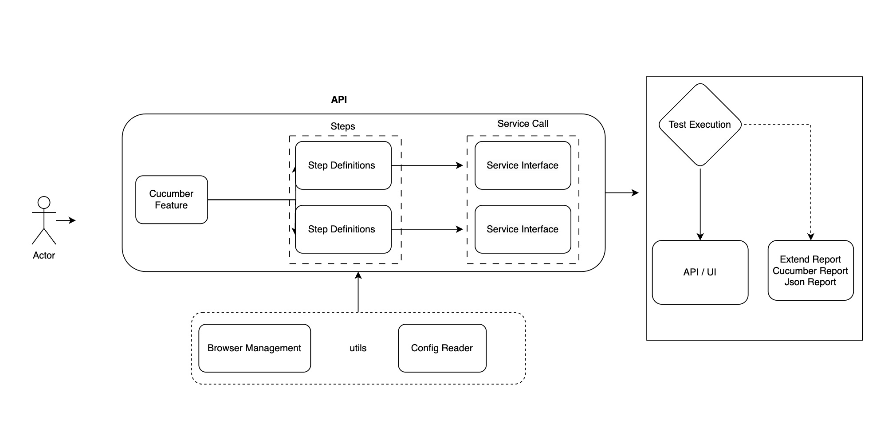
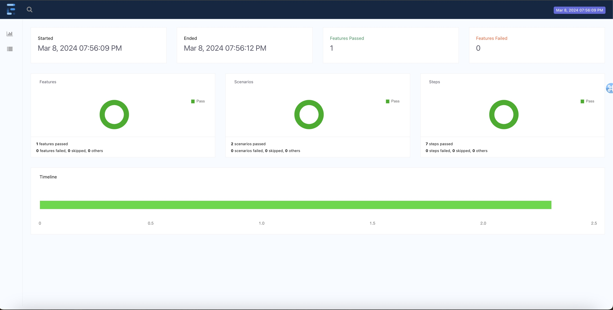

# Automated Functional Tests for techChallenge

### Summary

This repository contains the tests for API techChallenge, these tests are developed using RestAssured, Cucumber-jvm , TestNG

### Getting Started

Run all tests:

    > mvn clean test

Run a single test:

    > mvn clean verify -Dtest=ApiTestRunner

Extended HTML report:

Report is generated at `target/extend-report/spark.html`

# Test Framework Code Guidelines

### Specs

These classes are written in [Cucumber](https://cucumber.io/docs/reference#feature) feature files. They should be easily readable and should just contain BDD scenarios. These cucumber file should make a call only to steps.

Example:

```gherkin
  Scenario: Create a new profile
    Given the profile service is running
    When I create a new profile with username "john_doe", dateOfBirth "1990-01-01T00:00:00Z", gender "MALE", and subscribedMarketing "true"
    Then the profile is created successfully with userId "123"

```

These tests are written in the BDD format:
- Given = Preconditions for the test (Includes setting up mocks)
- When = Behaviours for the test
- Then = Assertions for the test (Only "Then"s should have assertions)

You can have multiples of each, however, "Given"s are always before all "When"s and "When"s are always before all "Then"s. A good rule of thumb is that all tests should never be more than five lines. If you find you have one longer than five lines, you might want to consider breaking it up into smaller tests.

### Steps Classes

In these classes there should be minimal logic. Here we should only, save values between steps, call methods on Screen Classes, get values from Screen Class methods and assert on them. This is not the place for loops, if statements or finding elements on a page. In addition, steps should never call other steps.

Simple Logic Examples:
- Go to page X
- Remember Y
- Perform action on screen
- Assert Z is Y- etc..

Examples:

```java
    @Given("the profile service is running")
    public void startProfileService() {
        profileService = new ProfileService();
        profileService.startServer();
    }
```
### Stable Tests

Non-Determinism in tests is worse than not having any tests at all. Before pushing any new tests run them five times in a row without a single fail.

### Code Quality

Code should be clean and kept to the same standard as production code, i.e. no lazy coding - make sure unused imports are removed, code is correctly aligned (IntelliJ - CMD+OPTION+L), with no random newlines and whitespaces. Where possible Java style guidelines should be followed.


### Framework


### Sample Summary Report

#### [Html Report](docs/extend-report/spark.html)

 
